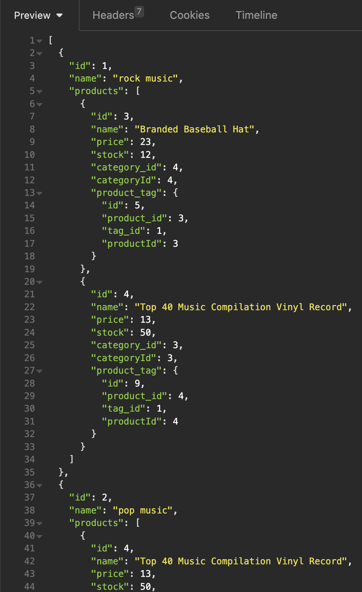
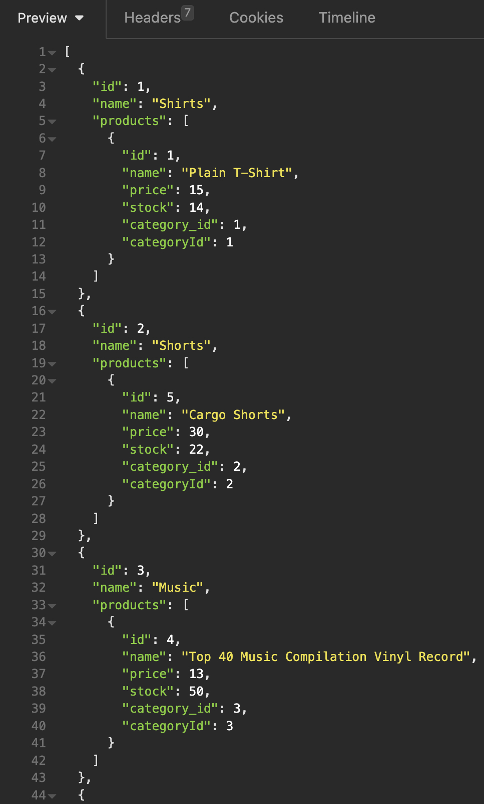
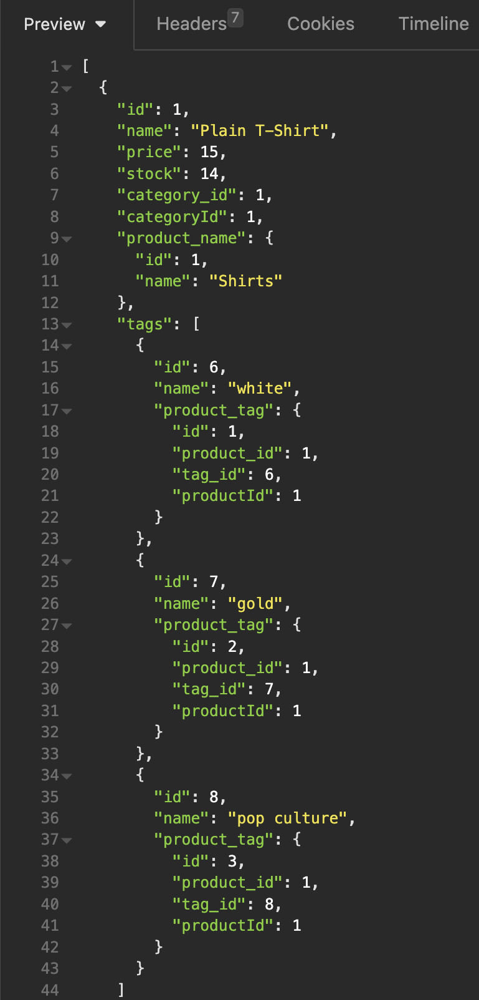

# ORM E-Commerce Back End

## Description

A demonstration of the funamental architecture of an e-commerce site. Using given starter code the back end was then configured with a working Express.js API to use Sequelize to interact with a MySQL database.

This applictaion uses:

- [Express.js](https://www.npmjs.com/package/express)
- [MySQL2 Package](https://www.npmjs.com/package/mysql2)
- [Insomnia](https://insomnia.rest/)

[YouTube: ORM E-Commerce Back-End Video Demonstration](https://www.youtube.com/watch?v=uWY5n3dM3VU)

## Tabel of Contents

- [ORM E-Commerce Back End](#orm-e-commerce-back-end) 
- [Description](#description) 
- [Tabel of Contents](#tabel-of-contents) 
- [User Story](#user-story) 
- [Acceptance Criteria](#acceptance-criteria) 
- [License](#license) 
- [Contributing](#contributing) 
- [Tests](#tests) 
- [Resources](#resources) 
- [Questions/Contact](#questionscontact)

## User Story

**AS A** manager at an internet retail company  

**I WANT** a back end for my e-commerce website that uses the latest technologies  

**SO THAT** my company can compete with other e-commerce companies

## Acceptance Criteria

**GIVEN** a functional Express.js API

**WHEN** I add my database name, MySQL username, and MySQL password to an environment variable file  
**THEN** I am able to connect to a database using Sequelize

**WHEN** I enter schema and seed commands  
**THEN** a development database is created and is seeded with test data

**WHEN** I enter the command to invoke the application  
**THEN** my server is started and the Sequelize models are synced to the MySQL database

**WHEN** I open API GET routes in Insomnia for categories, products, or tags  
**THEN** the data for each of these routes is displayed in a formatted JSON

**WHEN** I test API POST, PUT, and DELETE routes in Insomnia  
**THEN** I am able to successfully create, update, and delete data in my database

## License

Copyright 2024 Heinz Ulrich V

Licensed under the Apache License, Version 2.0 (the "License");
you may not use this file except in compliance with the License.
You may obtain a copy of the License at

       http://www.apache.org/licenses/LICENSE-2.0

Unless required by applicable law or agreed to in writing, software
distributed under the License is distributed on an "AS IS" BASIS,
WITHOUT WARRANTIES OR CONDITIONS OF ANY KIND, either express or implied.
See the License for the specific language governing permissions and
limitations under the License.

## Contributing

N/A

## Tests

None currently

## Resources

[How to use Inquirer.js](https://javascript.plainenglish.io/how-to-inquirer-js-c10a4e05ef1f)

[Insomnia](https://insomnia.rest/)

## Questions/Contact

**Developer:** Heinz Ulrich V

 

 

 

